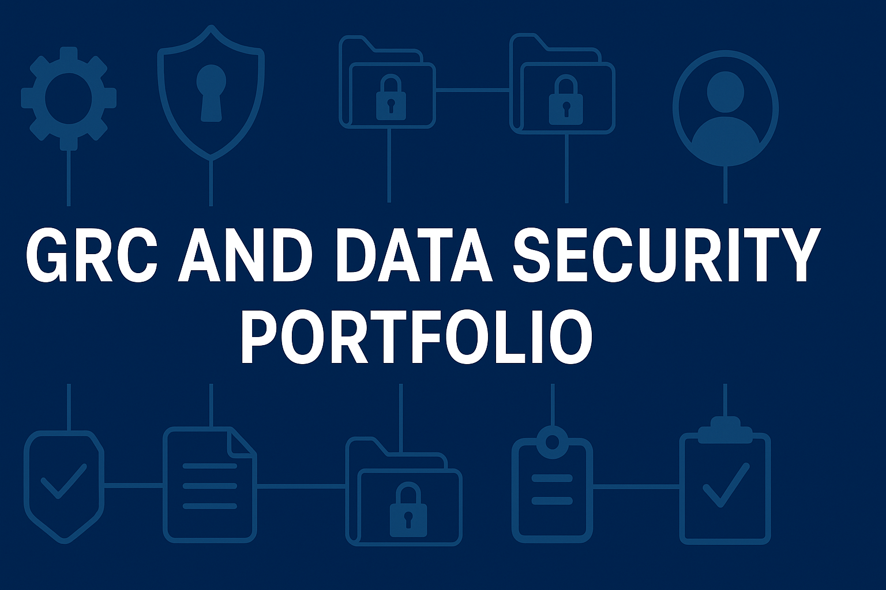
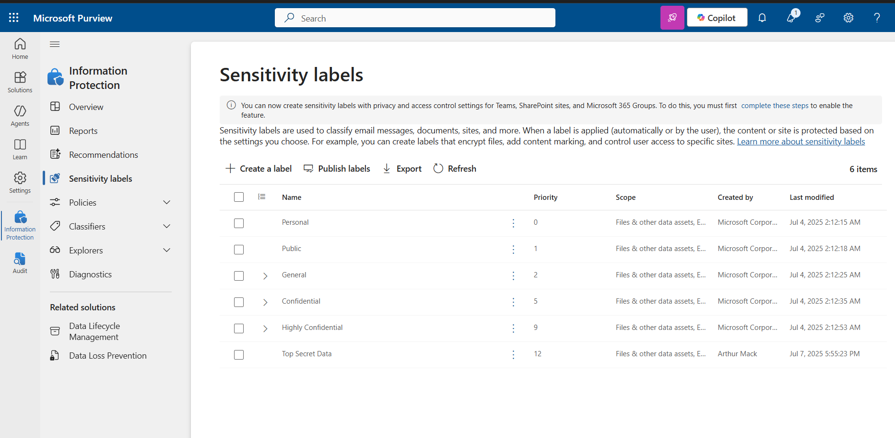
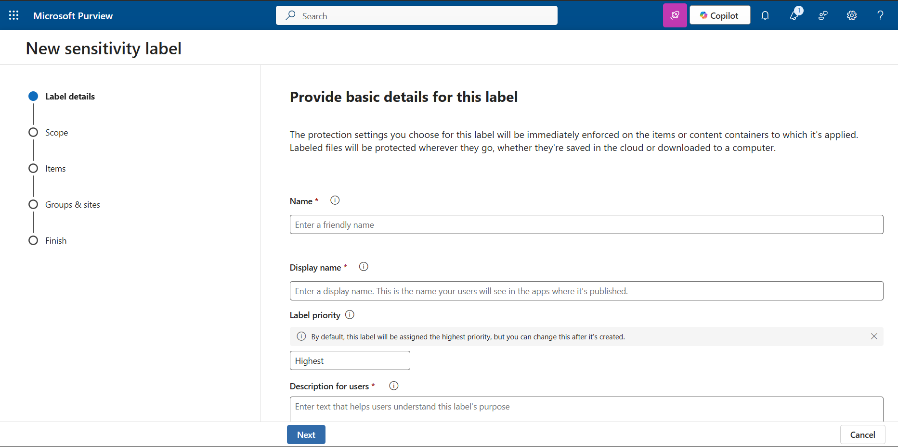
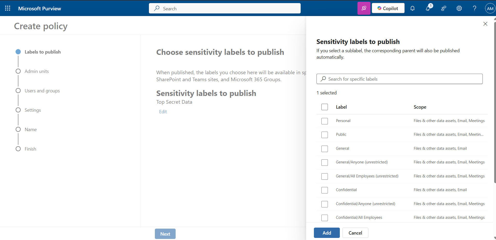
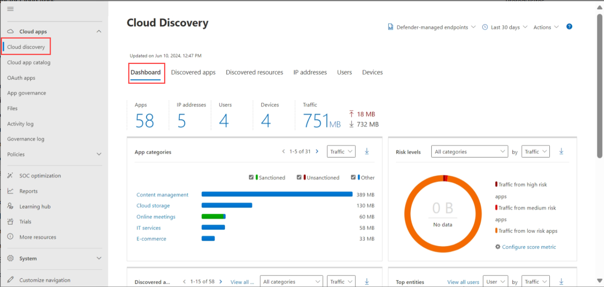
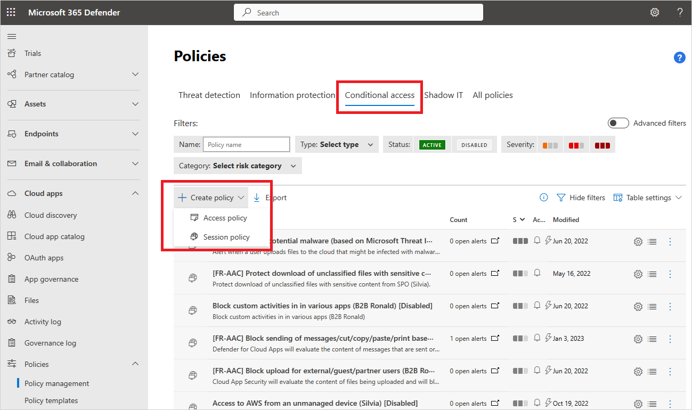
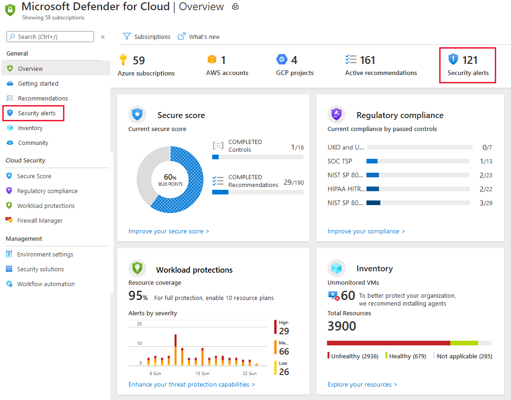
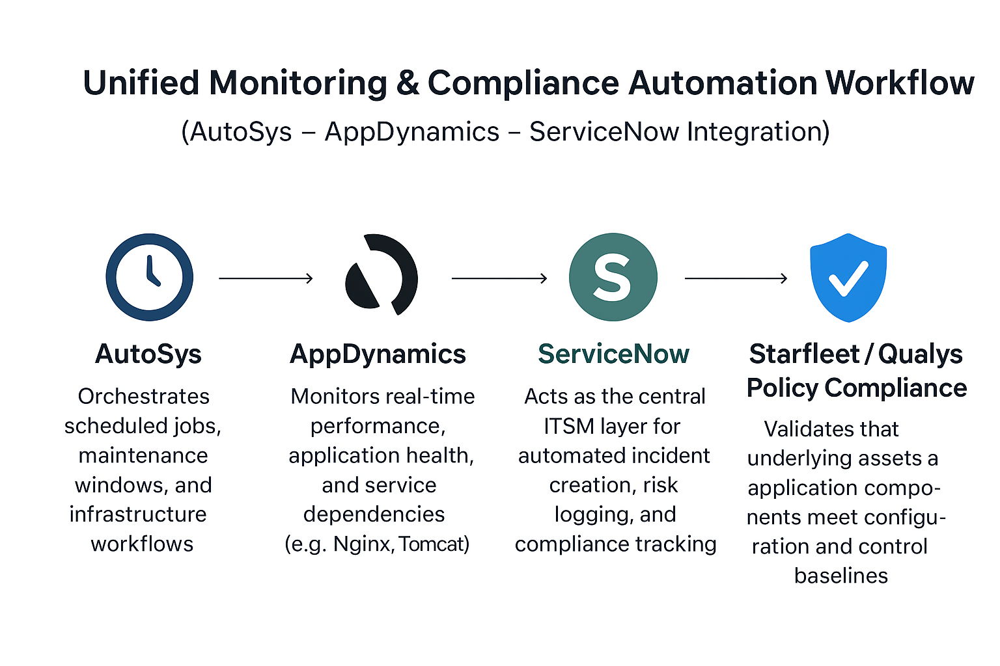

  

Welcome to my Governance, Risk, and Compliance (GRC) and Data Security Portfolio.  

### 📚 Summary

This portfolio showcases my dedication and expertise in risk governance, compliance frameworks, and data privacy and protection within organizations. It reflects my hands-on experience, ongoing projects, and commitment to strengthening security and regulatory adherence. Currently, I am enhancing my skills through certification and training in CRISK, CCSP, and Microsoft 365 Compliance Portal to further expand and demonstrate my capabilities in these specializations.

---

## 📚 GRC and Data Security Overview

Governance, Risk, and Compliance (GRC) is a unified framework that enables organizations to achieve their objectives effectively while managing uncertainty and maintaining integrity. It encompasses the policies, procedures, and technologies designed to ensure that business operations align with regulatory requirements, mitigate risks, and uphold organizational standards.

**Data Security** is a critical component within the GRC framework, focusing on protecting sensitive information from unauthorized access, breaches, and data leakage. Effective data security measures support compliance efforts, reduce organizational risk exposure, and foster trust with customers and stakeholders.

By integrating GRC practices with robust data security strategies, organizations can create a resilient environment that not only adheres to industry standards ISO 27001, NIST, and PCI-DSS but also proactively defends against evolving cyber threats.

| Pillar         | Description                                                                                                                                                                                      
|----------------|-------------------------------------------------------------------------------------------------------------------------------------------------------------------------------------------------|
| **Governance** | Ensures alignment of IT/security initiatives with business goals, including policies, roles, frameworks (e.g., NIST, ISO 27001), and overall strategic direction. Incorporates data security policies and controls. |
| **Risk Mgmt.** | Identifies, assesses, and mitigates risks to critical assets — often through risk registers, assessments, KRIs, and POA&Ms.                                                                      
| **Compliance** | Ensures adherence to legal, regulatory, and policy obligations (e.g., HIPAA, SOX, PCI-DSS, FedRAMP). Supported by evidence collection, UARs, and audits.                                            |
| **Data Security** | Focuses on protecting sensitive and critical data from unauthorized access, breaches, and leaks. Encompasses data classification, access controls, encryption, and monitoring to ensure data integrity and confidentiality. |

---

### 🏦 Financial Regulations & Cybersecurity Frameworks

This section provides an overview of key U.S. and international financial regulations and cybersecurity frameworks vital for compliance, risk management, and data security. It includes detailed references and resources for frameworks such as ISO 27001, NIST, GDPR, Basel III, and others, helping organizations strengthen their security posture and regulatory adherence.
- [🏦 Financial Regulations & Cybersecurity Frameworks](financial-regulations/financial-regulations.md)
  
### 🔐 Controls Mapping Guide

- 🔐 For a detailed control mapping across standards and frameworks, see the [Controls Mapping Guide](financial-regulations/Controls_Mapping_Guide.md).
---

## 🔐 Data Privacy & Data Protection Projects

| **Projects & Focus**                     | **Skills & Achievements**                                                    |
|------------------------------------------|-------------------------------------------------------------------------------|
| Microsoft Purview DLP Lab                | Developed data loss prevention policies, sensitivity labels, and custom info types in Purview |
| Regex & Sensitive Info Types             | Created custom regex patterns for detecting PII, PHI, PCI data within compliance workflows |
| Policy Lifecycle Automation              | Simulated full policy lifecycle — approval, deployment, and review — aligned with ISO and NIST standards |
| Controls Mapping                         | Mapped controls to frameworks like ISO 27001 and NIST, demonstrating governance and compliance management |

---

### 🔐 Microsoft Purview Data Protection and DLP Labs

Simulated Data Loss Prevention and Data Protection labs using Microsoft Purview:
- 📦 Built policies to protect PII, PHI, and PCI across O365 apps
- 🧪 Used simulation mode to test policy behavior before enforcing
- ⚙️ Activated enforcement actions and tracked alerts
- 🎯 Integrated Adaptive Protection with user risk scoring

📁 [View PDF](./purview-lab/Microsoft_Purview_DLP_Lab.pdf)

⚙️ [Microsoft Purview DLP Lab](./purview-lab/Microsoft_Purview_DLP_Lab.md)  
  _Simulate and manage M365 DLP using Microsoft Purview — includes screenshots and a policy template._

### 📸 Microsoft Purview Data Protection and DLP Lab Screenshots

- Hands-on exploration of Microsoft Purview's Sensitive Information Types.

- Hands-on exploration of Microsoft Purview's Sensitive Labels.

- Hands-on exploration of Microsoft Purview's New Sensitive Label.

- Hands-on exploration of Microsoft Purview's Sensitivity Labels to Publish.

  
- Hands-on exploration of Microsoft Purview's Data Loss Prevention | Policy.

Access the lab here: [Microsoft Purview DLP Lab](purview-lab/Microsoft_Purview_DLP_Lab.md)
  
---

### 🔐 Microsoft Defender for Cloud Apps (CASB)

**Overview:**  
Microsoft Defender for Cloud Apps (formerly known as Microsoft Defender for Cloud App Security) is a Cloud Access Security Broker (CASB) solution that provides visibility, control over data, and sophisticated analytics to identify and combat cyber threats across cloud applications. It enables organizations to monitor cloud app usage, enforce policies, detect anomalies, and mitigate risks related to shadow IT and data breaches.

### ⚙️ **Features:**  

- ✅ **Visibility & Monitoring:** Gain insights into cloud app usage across your organization.  
- 🔄 **Data Control:** Enforce policies to protect sensitive data and prevent data leakage.  
- 📊 **Threat Detection:** Detect suspicious activities and anomalies with advanced analytics.  
- ✅ **Risk Assessment:** Evaluate cloud app risk levels to inform security decisions.  
- 📊 **Secure Collaboration:** Manage sharing and access controls for cloud resources.  
- 🔄 **Integration:** Seamlessly integrates with Microsoft 365 Security & Compliance tools for comprehensive security management.

**Features covered in the current Microsoft Defender Course:**  
- 📊 Deploying and configuring Microsoft Defender for Cloud Apps  
- 🔄 Setting up policies for data protection and threat detection  
- 📊 Conducting activity investigations and incident response  
- ✅ Hands-on simulations to reinforce understanding of security workflows

### 📸 Microsoft Defender for Cloud Apps (CASB) Lab Screenshots

- Hands-on exploration of Microsoft Defender Cloud Apps: Discovery.

- Hands-on exploration of Microsoft Defender Cloud Apps: Create Policies.

- Hands-on exploration of Microsoft Defender Cloud Apps: Security Alerts.

Access the lab here: [Microsoft Defender for Cloud Apps (CASB) Lab](purview-lab/Microsoft_Defender_for_Cloud_Apps_CASB_Lab.md)

---

### 💼 Purview Regex Expressions & Custom Sensitive Information Types

### 📘 Microsoft Purview Regex Expressions & Custom Sensitive Information Types

This section provides curated and custom-built Regular Expressions (Regex) for use in **Microsoft Purview** Data Loss Prevention (DLP) and Information Protection policies.

These patterns are used to define **Custom Sensitive Information Types (SITs)** that extend beyond the default Purview catalog and help address compliance with frameworks such as **NIST, HIPAA, PCI-DSS, GDPR**, and **ISO 27001**.

---

## 📚 About Microsoft Purview Custom SITs

Microsoft Purview lets you define your own custom Sensitive Information Types (SITs) to detect proprietary, regulated, or internal data formats using:

- Regular Expressions (Regex)
- Keyword Lists
- Supporting Elements (keywords or regex)
- Confidence levels
- Proximity tuning
---

## 🎓 Automation
## 🔄 AutoSys AppDynamics ServiceNow Integration Workflow

This integration streamlines operational intelligence, job scheduling, and ITSM workflows:

- **AutoSys** handles enterprise job scheduling and automation, ensuring workloads run on time across distributed systems.  
- **AppDynamics** monitors the performance and health of critical applications (e.g., Nginx, Tomcat) in real time.  
- **ServiceNow** correlates alerts, incidents, and performance metrics for rapid triage and remediation.  

### 🌐 Integration Benefits
- Real-time mapping of application performance to scheduled jobs and infrastructure health.  
- Automated ServiceNow ticket creation and updates from AppDynamics alerts or AutoSys job failures.  
- End-to-end visibility into operational risk, compliance impact, and change management cycles.  

  

## 🛰️ Unified Monitoring & Compliance Automation Workflow  
### *(AutoSys – AppDynamics – ServiceNow Integration)*

This unified workflow bridges **operations**, **security**, and **compliance** across enterprise systems to enhance visibility, automation, and governance alignment.

- **AutoSys** — Orchestrates scheduled jobs, maintenance windows, and infrastructure workflows across hybrid environments.  
- **AppDynamics** — Monitors real-time performance, application health, and service dependencies (e.g., Nginx, Tomcat).  
- **ServiceNow** — Acts as the central ITSM layer for automated incident creation, risk logging, and compliance tracking.  
- **Starfleet / Qualys Policy Compliance** — Validates that underlying assets and application components meet configuration and control baselines.  

### 🚀 Key Benefits
- Automated ticket creation and CI correlation when AppDynamics detects job or service degradation.  
- Continuous control validation through Starfleet and Qualys compliance baselines.  
- Full traceability of job performance → application health → compliance posture.  
- Improved operational uptime and reduced MTTR through automation and integrated intelligence.  

  

## 🛠️ Tools Used
- AutoSys
- AppDynamics
- Microsoft Purview
- Microsoft 365 Compliance Portal
- Microsoft Defender for Cloud Apps (CASB)

---

## 🎓 Certifications & Trainings

Here are the certifications I've earned (or am actively pursuing) to reinforce my GRC and cybersecurity expertise:

| Certifications & Trainings | Status | Provider |
|---------------|--------|----------|
| ✅ CEH – Certified Ethical Hacker | Earned | EC-Council |
| ✅ Security+ (CompTIA) | Earned | CompTIA |
| ✅ AWS Certified Security – Specialty | Earned | AWS |
| 🔄 CCSP – Certified Cloud Security Professional  | In Progress | ISC² / Cybrary / Udemy |
| 🔄 CRISC – Certified in Risk and Information Systems Control | In Progress | ISACA / Cybrary / Udemy |
| ✅ Microsoft Purview Information Security Administrator Course | Completed | Microsoft Learn / Cybrary / Udemy |
| ✅ Microsoft Defender for Cloud Apps (CASB) Course | Completed | Microsoft Learn / Cybrary / Udemy |
| ✅ Definitive GRC Analyst Master Class | Completed | Simply Cyber Academy |   
| ✅ ServiceNow | Completed | ServiceNow Training | 
| ✅ Qualys PC, PCI, VMD | Completed | Qualys Training | 

---

## Learning Resources
  
✅ This portfolio is supported by a variety of training platforms, including:
- ✅ [CRISC (ISACA Prep Material)](https://www.isaca.org/credentialing/credentialing-exam-prep)
- ✅ [CCSP (ISC² Prep Material)](https://www.isc2.org/)
- ✅ [Governance, Risk, and Compliance (Udemy)](https://www.udemy.com/)
- ✅ [GRC for Banking, FinTech, and Insurance | GRC in Business (Udemy)](https://www.udemy.com/)
- ✅ [Data Security in GDPR, CCPA, HIPAA, PCI-DSS & SOX (Privacy) (Udemy)](https://www.udemy.com/)
- ✅ [Governance, Risk & Compliance Masterclass (Simply Cyber)](https://www.simplycyber.io/)
- ✅ [Microsoft Defender Course(CASB) (Udemy)](https://www.udemy.com/)
- ✅ [Microsoft Purview Information Security Administrator Course (Udemy)](https://www.cybrary.it/)
---
## 🔗 Connect With Me
- 📫 arthurmack@email.com  
- 🔗 [LinkedIn](https://www.linkedin.com/in/arthur-m-24a2a81ba/)
---

