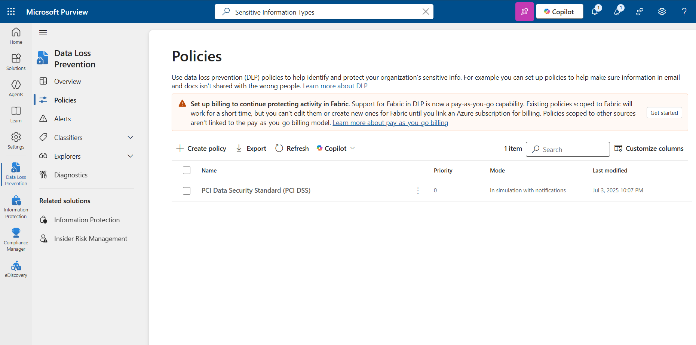

  

Welcome to my Governance, Risk, and Compliance (GRC) portfolio.  

### 📚 Summary
Aspiring GRC Manager & Data Protection Engineer focused on risk governance, compliance frameworks, and data privacy within financial institutions. Currently pursuing CRISC, CISM, and Microsoft Purview certifications to deepen my expertise.

## 📚 GRC Overview

Governance, Risk, and Compliance (GRC) is the integrated collection of capabilities that enable an organization to reliably achieve objectives, address uncertainty, and act with integrity.

| Pillar         | Description                                                                                                                                         |
|----------------|-----------------------------------------------------------------------------------------------------------------------------------------------------|
| **Governance** | Ensures alignment of IT/security initiatives with business goals, including policies, roles, and frameworks (e.g., NIST, ISO 27001).               |
| **Risk Mgmt.** | Identifies, assesses, and mitigates risks to critical assets — often through risk registers, assessments, KRIs, and POA&Ms.                        |
| **Compliance** | Ensures adherence to legal, regulatory, and policy obligations (e.g., HIPAA, SOX, PCI-DSS, FedRAMP). Supported by evidence collection, UARs, audits. |

## 🛠 GRC Portfolio Projects

Explore my hands-on work across key GRC domains, supported by custom labs, dashboards, and simulations.  
These projects reflect real-world implementation of industry frameworks (NIST, ISO 27001, PCI-DSS) and tools (Qualys, Microsoft Purview, ServiceNow).

| Project | Description | Skills & Tools |
|--------|-------------|----------------|
| **[Risk Register – NIST Mapped](./risk-register/Risk_Register_Template.md)** | Simulated risk register aligned with NIST SP 800-30/53 |   |
| **[Policy Lifecycle Governance](./policy-lifecycle/Policy_Lifecycle_Demo.md)** | Tracks a security policy from draft to retirement |   |
| **[Microsoft Purview DLP Lab](./purview-lab/Microsoft_Purview_DLP_Lab.md)** | Hands-on Data Loss Prevention lab with sensitivity labels and analytics |   |
| **[Compliance Dashboard](dashboards/README.md)** | Excel dashboard for KPI/KRI compliance tracking |   |
| **[Qualys → ServiceNow POA&M Lab](./qualys-servicenow-lab/POAM_Workflow_Example.md)** | Integrates Qualys policy failures into ServiceNow with POA&M logic |   |
| **[Regex Library for Custom Sensitive Info Types](./purview-regex/Regex_Custom_Sensitive_Information_Types.md)** | Custom regex patterns for Purview’s data classification engine |   |
| **[Regex Lab Exercises](./regex-library/labs/README.md)** | Lab-based regex detection exercises built for GRC/DLP training |   |

### 📄 Policy Lifecycle Demonstration

A real-world simulation of the full policy lifecycle:
- ✅ Created an Acceptable Use Policy mapped to NIST SP 800-53 and ISO 27001
- 🔄 Ran through approval, staff distribution, implementation, and annual review
- 📊 Tracked exceptions and monitored control coverage via ServiceNow and Microsoft Purview

📁 [View PDF](https://github.com/user-attachments/files/20845119/Policy_Lifecycle_Demo.pdf)
 
### 📊 Risk Register Template + Summary

This folder includes a structured and reusable Risk Register aligned with NIST CSF, ISO/IEC 27005, and CIS Controls.

- ✅ `Risk_Register_Template.xlsx` – Editable Excel template with:
  - Likelihood × Impact heatmap scoring
  - Residual Risk calculation
  - Fields for Risk Owner, Mitigation, and Control Mapping
- ✅ `Risk_Register_Example.pdf` – A sample filled-out risk register for reference
- 🔐 Frameworks Used:
  - NIST CSF
  - ISO/IEC 27001:2013 Annex A
  - CIS Controls v8

---

### 🏦 Financial Regulations & Cybersecurity Frameworks

This section provides an overview of key U.S. and international financial regulations and cybersecurity frameworks vital for compliance, risk management, and data security. It includes detailed references and resources for frameworks such as ISO 27001, NIST, GDPR, Basel III, and others, helping organizations strengthen their security posture and regulatory adherence.
- [🏦 Financial Regulations & Cybersecurity Frameworks](financial-regulations/financial-regulations.md)
  
### 🔐 Controls Mapping Guide

- 🔐 For a detailed control mapping across standards and frameworks, see the [Controls Mapping Guide](financial-regulations/Controls_Mapping_Guide.md).

---

## 🔐 Data Privacy & Data Protection Projects
- **Microsoft Purview DLP Lab:** Developed data loss prevention policies, sensitivity labels, and custom info types.
- **Regex & Sensitive Info Types:** Created custom regex patterns for detecting PII, PHI, PCI data in compliance workflows.
- **Policy Lifecycle Automation:** Simulated full policy lifecycle including approval, deployment, and review; aligned with ISO and NIST standards.
- **Controls Mapping:** Mapped controls to frameworks like ISO 27001 and NIST, demonstrating governance and compliance management.

---

### 🔐 Microsoft Purview DLP Lab

Simulated a full data loss prevention lab using Microsoft Purview:
- 📦 Built policies to protect PII, PHI, and PCI across O365 apps
- 🧪 Used simulation mode to test policy behavior before enforcing
- ⚙️ Activated enforcement actions and tracked alerts
- 🎯 Integrated Adaptive Protection with user risk scoring

📁 [View PDF](./purview-lab/Microsoft_Purview_DLP_Lab.pdf)

- 📂 [Microsoft Purview DLP Lab](./purview-lab/Microsoft_Purview_DLP_Lab.md)  
  _Simulate and manage M365 DLP using Microsoft Purview — includes screenshots and a policy template._

  - 📂 [Microsoft Purview – Keyword Dictionary Lab](./purview-keywords/README.md)

### 📸 Microsoft Purview DLP Lab Screenshots

- Hands-on exploration of Microsoft Purview's Sensitive Information Types.

- Hands-on exploration of Microsoft Purview's Data Loss Prevention | Policy.

🔗[View the full lab](./purview-lab/Microsoft_Purview_DLP_Lab.md)

## 🔗 Related Portfolio Sections

- [Microsoft Purview DLP Lab](purview-lab/Microsoft_Purview_DLP_Lab.md)
- [Compliance Dashboard Sample](dashboards/Compliance_Dashboard_Sample.md)

- --

### 📁 Purview Regex Expressions & Custom Sensitive Information Types

Explore Microsoft Purview's support for custom Sensitive Information Types using regular expressions (regex). Includes examples and templates.

- 🔍 [Custom Regex Template for Sensitive Info Types](./purview-regex/Custom_Sensitive_Information_Types_Template.md)
- 📘 [Purview Regex Overview README](./purview-regex/README_purview_regex.md)

---

### 🤝 Qualys–ServiceNow POA&M Integration Lab

Demonstrates automation of Plan of Action & Milestones (POA&M) workflows:
- 🔗 Triggered ServiceNow POA&M records from Qualys compliance scan failures
- 🛠 Mapped failed controls to CMDB Configuration Items (CIs)
- 🔄 Auto-assigned remediation deadlines with full lifecycle tracking
- 📊 Fed metadata into dashboards for audit and KPI reporting

📁 [Qualys-ServiceNow POA&M Lab (PDF)](./qualys-servicenow-lab/Qualys_ServiceNow_POAM_Lab.pdf)

### 📊 Compliance Dashboard (Excel)

Sample Excel dashboard tracking compliance status by control category and asset. Useful for audit readiness, KPI reporting, and control failure monitoring.

📁 [Download Compliance_Dashboard_Sample.xlsx](https://github.com/user-attachments/files/20845198/Compliance_Dashboard_Sample.xlsx)

---

- [Regex Expressions for Microsoft Purview](purview-lab/Regex_Expressions_for_Purview.md): A collection of regular expressions used to define sensitive information types (e.g., SSNs, credit cards, emails) for custom DLP policies in Microsoft Purview.

- # 🔍 Microsoft Purview Regex Expressions & Custom Sensitive Information Types

This section of the GRC Portfolio provides curated and custom-built Regular Expressions (Regex) for use in **Microsoft Purview** Data Loss Prevention (DLP) and Information Protection policies.

These patterns are used to define **Custom Sensitive Information Types (SITs)** that extend beyond the default Purview catalog and help address compliance with frameworks such as **NIST, HIPAA, PCI-DSS, GDPR**, and **ISO 27001**.

---

## 📁 Included in This Folder

| File | Description |
|------|-------------|
| - [Regex Expressions – Custom Sensitive Information Types](purview-regex/Regex_Custom_Sensitive_Information_Types.md)
| Contains regex patterns and logic used to detect custom SITs, including U.S. SSNs, ABA Routing Numbers, IBANs, SWIFT Codes, Employee IDs, and more. |
| Sample JSON definitions (Coming soon) | Will include sample definitions formatted for Microsoft Purview via JSON for direct import via Microsoft 365 Compliance Center. |

---

## 🧪 Use Cases

These custom expressions allow detection of:

- U.S. Social Security Numbers (SSNs)
- International Bank Account Numbers (IBAN)
- U.S. Routing Numbers (ABA)
- Employee or Personnel IDs
- SWIFT/BIC Codes
- Custom Company Identifiers (e.g., internal HR codes or contract numbers)

---

## 📚 Why Custom SITs Matter

Default sensitive information types in Microsoft Purview are powerful but **may not cover unique business identifiers** or regional data types critical for:

- Regulatory audits (e.g., HIPAA, PCI-DSS)
- Contractual obligations with third parties
- Risk-based data classification
- Sector-specific standards like **NIST SP 800-53** or **CJIS**

Custom SITs bridge this gap and ensure **granular visibility and data protection** across structured and unstructured content.

---

## 🔧 Integration Instructions

1. Open Microsoft Purview compliance portal.
2. Navigate to **Data Classification** → **Sensitive Information Types** → **Create Sensitive Info Type**.
3. Use the regex patterns provided in the markdown file.
4. Define supporting evidence keywords (optional).
5. Apply SIT to your custom DLP or auto-labeling policies.

---
# 🔐 Purview Regex Expressions & Custom Sensitive Information Types

This folder contains:

- ✅ Sample Regular Expressions for use in Microsoft Purview custom Sensitive Information Types
- ✅ Custom Sensitive Information Types Template & Examples

---

## 📁 Files Included

| File Name                                      | Description                                                        |
|-----------------------------------------------|--------------------------------------------------------------------|
| `Regex_Custom_Sensitive_Information_Types.md` | Reference guide for regex patterns used in data classification     |
| `Custom_Sensitive_Information_Types_Template.md` | Template for building custom SITs with all required components     |

---

## 📚 About Microsoft Purview Custom SITs

Microsoft Purview lets you define your own custom Sensitive Information Types (SITs) to detect proprietary, regulated, or internal data formats using:

- Regular Expressions (Regex)
- Keyword Lists
- Supporting Elements (keywords or regex)
- Confidence levels
- Proximity tuning

Use these tools to enhance your DLP policies and Insider Risk Management detection capabilities.

---

🔗 Return to the main GRC Portfolio: [GitHub Repo](https://github.com/agustus9/grc-portfolio)

---

## 🛠️ Tools Used

- Microsoft Purview
- Regex101 (for testing)
- Microsoft 365 Compliance Portal

---

## 💼 GRC Skills Matrix (2025+)

- Data classification & labeling
- Data discovery & risk assessment
- Data governance policies
- Data lifecycle management
- Compliance monitoring & reporting
- Use of Microsoft Purview, Power BI, and automation tools

This section provides a strategic mapping of **in-demand GRC skills** aligned with Arthur Mack’s real-world projects and professional capabilities.

📄 [View Full Skills Overview →](./GRC_Skills_Overview.md)

Highlights:
- Maps key enterprise-ready GRC capabilities (Governance, Risk, Compliance, Vulnerability Mgmt, Cloud, Audit)
- Aligns each skill with lab artifacts from this GitHub portfolio
- Reflects current job market priorities (based on 2025 hiring trends)

## 💼 Skills Overview

📄 [🧰 Tools You’ve Mastered](./tools-mastered.md)  
A detailed breakdown of all security, compliance, cloud, and automation tools I’ve worked with hands-on across projects and professional roles.

✅ 

---

## 🎓 Certifications

Here are the certifications I've earned (or am actively pursuing) to reinforce my GRC and cybersecurity expertise:

| Certification | Status | Provider |
|---------------|--------|----------|
| ✅ CEH – Certified Ethical Hacker | Earned | EC-Council |
| ✅ Security+ (CompTIA) | Earned | CompTIA |
| ✅ AWS Certified Security – Specialty | Earned | AWS |
| 🔄 CRISC – Certified in Risk and Information Systems Control | In Progress | ISACA |
| 🔄 CISM – Certified Information Security Manager | In Progress | ISACA |
| ✅ Microsoft Purview DLP Administrator Course | Completed | Udemy / Microsoft Learn |
| ✅ Definitive GRC Analyst Master Class | Completed | Simply Cyber Academy |

---

## 🔗 Connect With Me

- 📫 arthurmack@email.com  
- 🔗 [LinkedIn: Arthur Mack](https://www.linkedin.com/in/arthur-m-24a2a81ba/)

## Learning Resources
  
- ✅ This portfolio is supported by a variety of training platforms, including:
- 🔄 [Cybrary: CRISC & CISM by Kelly Handerhan](https://www.cybrary.it/)
- 🔄 [Udemy: Governance, Risk, and Compliance 2025](https://www.udemy.com/)
- ✅ Microsoft Learn, ISACA prep material, and personal lab simulations
- ✅ [Simply Cyber: Practical Cybersecurity Skills & GRC Training](https://www.simplycyber.io/)

---

  

