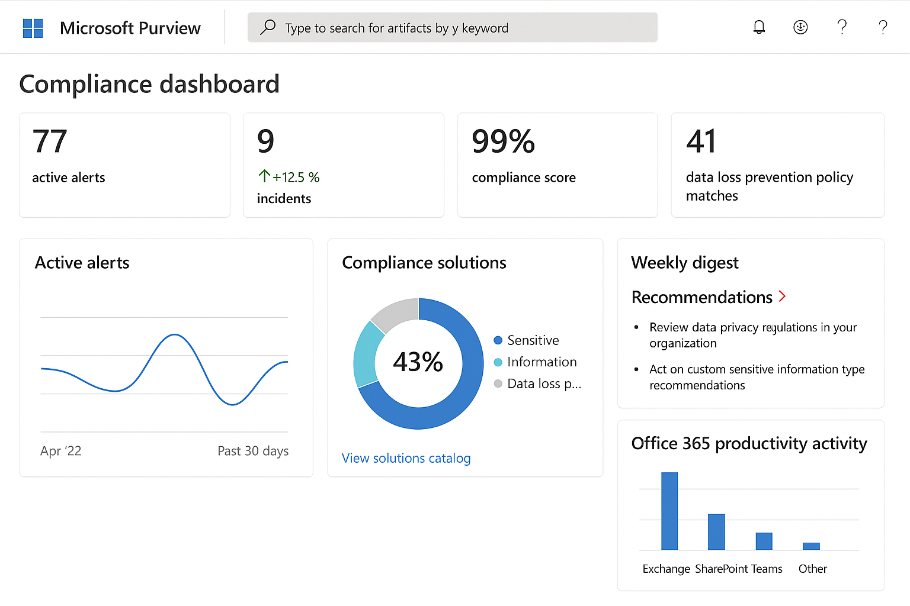

# Compliance Dashboard Sample

This dashboard is designed to visualize compliance status across multiple systems, mapping results to frameworks such as NIST, ISO 27001, and CIS Controls.

## Dashboard Features
- Compliance heatmap by system or control
- KPIs: % Compliant, % Not Compliant
- Drill-down views by framework or business unit
- Integration-ready format for Excel or Power BI

## Screenshot

---

📂 File: `Compliance_Dashboard_Sample.xlsx`
