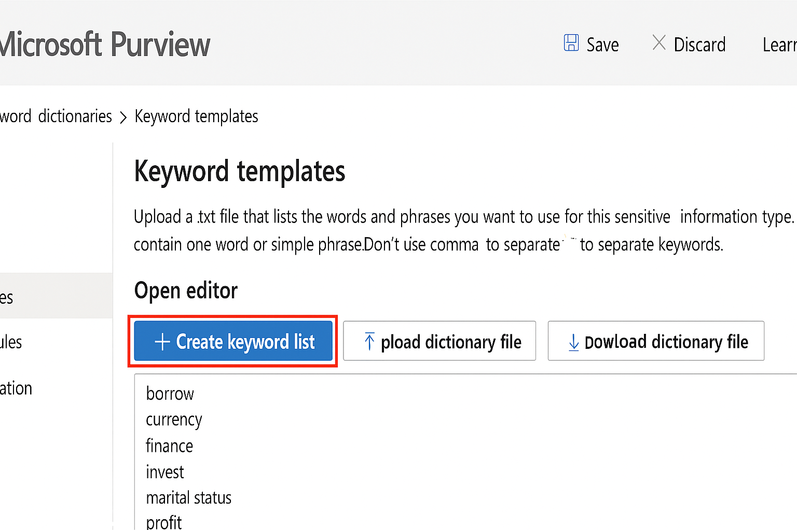

# Microsoft Purview – Keyword Dictionary Lab

This section documents how to create and import custom keyword dictionaries into Microsoft Purview for use in Sensitive Information Types (SITs).

## 📘 Overview

Keyword dictionaries help detect specific terms or phrases that relate to regulated or business-sensitive content. These dictionaries can be used to trigger DLP policies.

## Microsoft Purview – Keyword Dictionary Lab

This lab demonstrates how to create and import custom keyword dictionaries into Microsoft Purview.

📄 Keyword Sets:
- [financial_terms.txt](./financial_terms.txt)
- [healthcare_terms.txt](./healthcare_terms.txt)

🖼️ Visual Guide:
- 

### Lab Objectives:
- Understand what keyword dictionaries are and their role in data classification.
- Learn how to format and import .txt files for financial and healthcare term detection.
- Visual walkthrough using Purview’s web interface.

