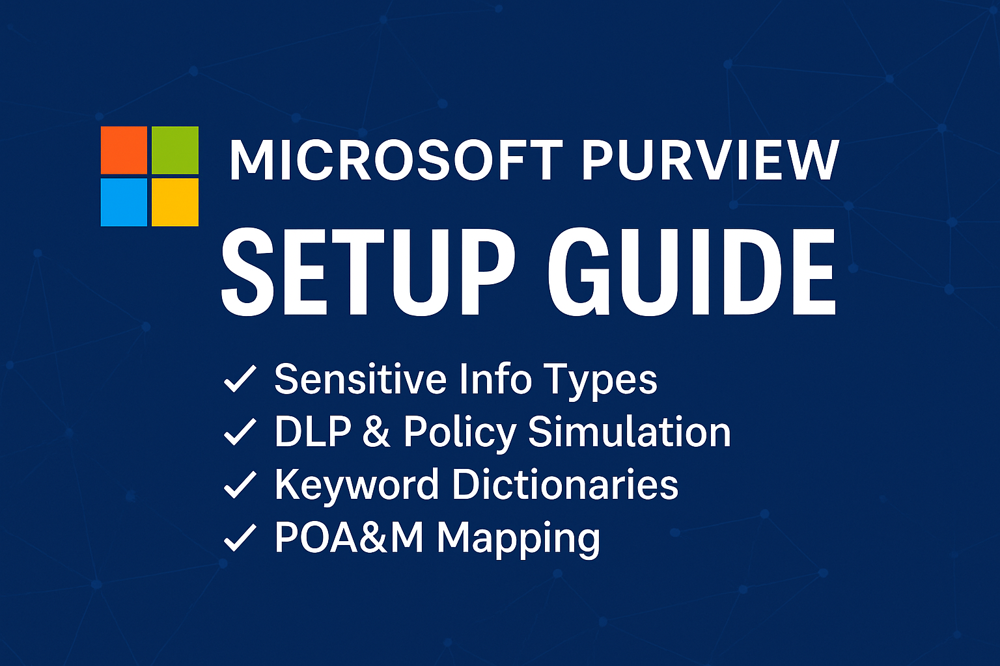

# Microsoft Purview – DLP Simulation Lab

This GitHub-based lab simulates how Microsoft Purview’s DLP tools can be structured and implemented using prewritten templates, keyword dictionaries, and POA&M response workflows.

> 🧪 This is a simulated training lab, not a production environment.

---

## 🧬 1. Sensitive Information Types

Microsoft Purview offers built-in and custom **Sensitive Information Types (SITs)** for identifying data like credit cards, SSNs, or healthcare info.

You can also create **Custom SITs** using:
- **Regex patterns**
- **Keyword dictionaries**
- **Supporting evidence (confidence levels)**

📸 Screenshot:  

---

## 🛡️ 2. DLP & Policy Simulation

Use our Excel-based **DLP policy template** to simulate rule creation for Microsoft Purview.

📄 Download: [DLP_Policy_Template_SAMPLE.xlsx](DLP_Policy_Template_SAMPLE.xlsx)

Policy Components:
- Conditions (e.g., detects “financial terms”)
- Actions (e.g., block download, alert admin)
- Scopes (e.g., SharePoint, Teams, Exchange)

📸 Screenshot:  

---

## 🗂️ 3. Keyword Dictionaries

Purview supports uploading custom keyword lists to create **dictionary-based SITs**.

📄 Sample Files:
- [financial_terms.txt](../purview-keywords/financial_terms.txt)
- [healthcare_terms.txt](../purview-keywords/healthcare_terms.txt)

🧭 Import Instructions:  
[Keyword Dictionary Setup Guide](../purview-keywords/README.md)

---

## 🛠️ 4. POA&M Mapping

Violations detected by DLP should be documented in a **Plan of Action & Milestones (POA&M)**.

📄 Template: [POAM_Workflow_Example.xlsx](../qualys-servicenow-lab/POAM_Workflow_Example.xlsx)

| Incident | Control | Action | Owner | Due Date |
|----------|---------|--------|--------|----------|
| Sensitive info emailed externally | NIST 800-53 AC-21 | Auto-revoke access | Security Compliance | 30 days |

---

> 🔄 This lab continues to evolve with additional templates, rules, and dashboards.  
> Explore more in: [Regex Library](../regex-library/) | [Keyword Lab](../purview-keywords/)
